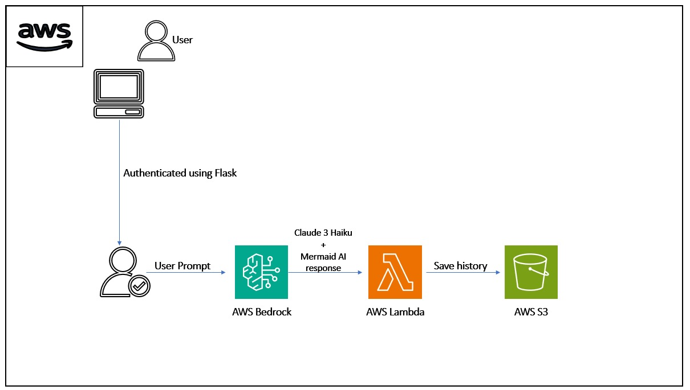

# AI Learning Path Generator

The **AI Learning Path Generator** is a web-based application designed to help users create personalized learning roadmaps for mastering various AI topics, such as **Machine Learning with Python**. This tool generates a comprehensive learning path for users based on their chosen course, ensuring a structured and guided approach to learning.

## Table of Contents

- [Project Overview](#project-overview)
- [Key Features](#key-features)
- [Tech Stack](#tech-stack)
  - [Frontend](#frontend)
  - [Backend](#backend)
  - [AWS Services](#aws-services)
  - [API](#api)
- [AI Models Used](#ai-models-used)
- [How to Run](#how-to-run)
- [Contributing](#contributing)
- [License](#license)

## Project Overview

### Architecure 



The **AI Learning Path Generator** provides users with the following features:

- **Course Duration:** The total time estimated to complete the course.
- **Topics Breakdown:** A daily or weekly study plan of topics to cover.
- **External Resources:** Suggested learning materials including YouTube videos, online tutorials, articles, and more.
- **Potential Projects:** Recommended projects to work on after completing specific milestones.
- **Flowchart Visualization:** A dynamic visual flowchart representing the entire learning journey.
  
Additionally, the application tracks users' progress, study history, streaks, and earned badges. These features help maintain motivation and consistency in the learning process.

## Key Features

- **Personalized Learning Paths:** Tailored study plans with detailed topics, external resources, and project ideas.
- **Progress Tracking:** Visualize your learning history, track progress, and continue from where you left off.
- **Badges & Streaks:** Earn rewards for consistent study habits, motivating you to stay on track.
- **Flowchart Visualization:** A beautifully generated flowchart of your personalized learning journey.
- **Cloud Storage:** All user data, including progress and learning history, is securely stored in the cloud and accessible anytime.
  
## Tech Stack

### Frontend

- **React:** A JavaScript library for building dynamic and responsive user interfaces. React is used to handle the user interactions and render the learning paths, progress, and flowchart visualization.

### Backend

- **Flask:** A lightweight Python web framework used to build RESTful APIs to handle user requests, including generating personalized learning paths, storing progress, and managing badges and streaks.

### AWS Services

- **AWS Lambda:** Serverless compute service that runs backend functions without the need for provisioning servers. Used to execute core backend operations like generating learning paths.
- **AWS S3:** Object storage service for storing and serving user-generated data, such as progress logs, flowchart data, and badges.
- **AWS Bedrock:** A suite of AI services used to enable generative AI models, enhancing the user experience with intelligent features such as personalized learning suggestions and dynamic project recommendations.

### API

- **Mermaid:** Used to generate flowcharts of the entire learning path. Mermaid’s integration allows real-time visualization of the user’s journey in the form of interactive, easy-to-understand flowcharts.

## AI Models Used

- **Claude:** A powerful generative AI model that assists in personalizing the learning journey by suggesting optimal study paths and providing intelligent project recommendations based on user progress.
- **DeepSeek:** An advanced AI model that analyzes the user’s preferences and learning pace to propose relevant external resources and adaptive learning techniques.

## How to Run

### Prerequisites

- Node.js (for frontend)
- Python 3.x (for backend)
- AWS account with configured Lambda, S3, and Bedrock
- Git (for version control)

### Steps

1. **Clone the repository:**

    ```bash
    git clone https://github.com/your-username/ai-learning-path-generator.git
    cd ai-learning-path-generator
    ```

2. **Install dependencies:**

    - Frontend (React):

      ```bash
      cd frontend
      npm install
      ```

    - Backend (Flask):

      ```bash
      cd backend
      pip install -r requirements.txt
      ```

3. **Set up AWS services:**

    - Configure AWS Lambda and S3 to handle backend and storage functionality.
    - Set up AWS Bedrock for generative AI capabilities.
    
    Make sure your AWS credentials are correctly configured.

4. **Run the application:**

    - Start the frontend:

      ```bash
      cd frontend
      npm start
      ```

    - Start the backend:

      ```bash
      cd backend
      python app.py
      ```

5. **Access the app:**

    Open your browser and navigate to `http://localhost:3000` to start using the AI Learning Path Generator.

## Contributing

We welcome contributions to improve the **AI Learning Path Generator**. Here’s how you can help:

- **Bug Fixes**: If you find a bug, please open an issue and submit a pull request with the fix.
- **Feature Requests**: If you have an idea for a new feature, feel free to open an issue or submit a pull request.
- **Documentation**: Help improve the documentation by submitting pull requests.

To get started, fork the repository, make your changes, and create a pull request.

## License

This project is licensed under the MIT License - see the [LICENSE](LICENSE) file for details.

---

Thank you for using the **AI Learning Path Generator**! We hope it helps you in your learning journey and motivates you to reach new heights in AI and machine learning.

For more details, check out our documentation or reach out to us with any questions!
